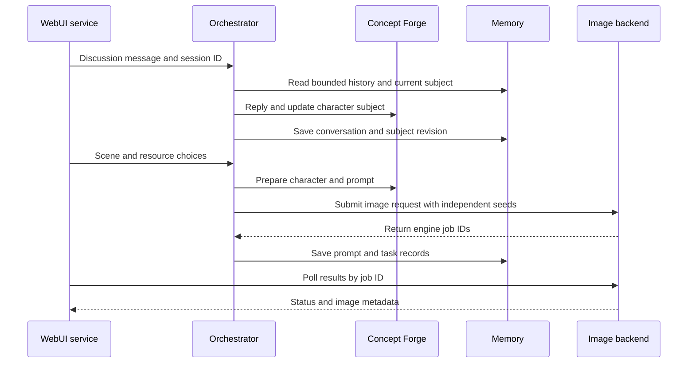

# EverSpark Forge architecture (v0.1)

EverSpark Forge routes discussion and generation through a coordinator to separate concept processing and image execution modules. Ollama is the built-in concept provider; user-configured OpenAI Compatible services use a separate adapter. ComfyUI is the default image engine, with an optional Diffusers plugin. This guide describes the implemented boundaries and data flow.

## 1. System boundaries

| Layer | Current responsibility | Main code |
| --- | --- | --- |
| WebUI | Browser interaction, same-origin API proxy, results and images, runtime status | `WebUI/` |
| Orchestrator | Sessions and request routing, generation tasks, resource choices, download and backup task entry points | `Orchestrator/` |
| Concept Forge | Language model interaction, character subject creation and validation, prompt compilation | `ConceptForge/` |
| Memory | Conversation history, character associations and revisions, prompt documents, task records | `Memory/`; data in `Data/Memory/` and `Data/Subjects/` |
| Image Forge | Read API Format workflows, populate prompts and parameters, submit image tasks | `ImageForge/` |
| Runtime / Launcher | Install and launch managed services, discover hardware, check processes and health, log output | `Runtime/`, `Launcher/`, root `everspark` |
| Infrastructure | Optional rclone storage and Cloudflare Tunnel; unnecessary in local mode | `Infrastructure/` |

ComfyUI and Ollama live in the managed runtime, rather than naming EverSpark modules. Models, private configuration, outputs, and memory are outside the published source. See [Runtime and data](Runtime-and-Data.md) for paths and migration.

## 2. Request flow

The browser talks to WebUI alone. The WebUI service proxies discussion, generation, character, and storage requests to Orchestrator. Result polling and image retrieval use same-origin endpoints backed by Image Forge's selected engine. Concept Forge sends normalized requests through its gateway to either the built-in Ollama adapter or a configured OpenAI Compatible adapter. The sequence summarizes responsibilities; validation and failure paths also occur during subject updates, prompt creation, and database writes.

### Discussion and character subjects

Each conversation has one current character subject. Orchestrator obtains bounded conversation history and the current document from Memory, asks Concept Forge to create or revise a subject from the discussion, validates it, and saves a revision. The user can select an existing character for the current conversation in WebUI.

`Character Subject v1` stores **reusable character identity**. Scene, pose, camera, and background belong to an individual request, rather than identity fields. The system separately stores the most recent positive and negative prompt documents; the positive prompt can include the previous scene for subsequent generation context. Those documents are distinct from the identity document.

### Generation and retrieval

Orchestrator reads the current subject and context again. Concept Forge prepares a generation plan and prompts, merging compiled character identity with this request's scene. Generation starts as a background task so the WebUI can poll planning progress without keeping the initial HTTP request open. Image Forge assigns independent seeds and routes each image request to the chosen plugin. ComfyUI makes a **per-task copy** of a registered API Format workflow and binds checkpoint, VAE, and LoRA choices; Diffusers executes a compatible SDXL single-file checkpoint through its separate worker. Selecting resources does not rewrite repository workflows.

When planning completes, Orchestrator records the engine job IDs (`prompt_id` values in the WebUI task response). WebUI polls task status and displays results. A batch of images belongs to one generation request. Recent results appear in Gallery and outputs default to `Data/Outputs/`.

## 3. Configuration and resources

Without a private `.env`, storage and networking are local. Runtime defaults are spread across module configuration files, including `orchestrator/config/default_config.json`. `Configuration/default.yaml` describes the public configuration contract; during this migration, not every service loads from one shared YAML loader. See [Configuration](Configuration.md) for importing `env.txt` / `.env` and enabling optional backends.

Orchestrator aggregates resources for WebUI: workflows and image models from the selected image plugin, Ollama models, and explicitly configured OpenAI Compatible connections. Users add and test external services in **Model services**, choose a service and model in Forge, and can set a default for subject revisions. Connection credentials live under `Data/Configuration/ConceptForge/`, outside source and character ZIP exports. Choices accompany individual requests. Execution depends on the chosen plugin and model compatibility.

Managed setup prepares a usable starter path but does not require a particular private model. The ComfyUI workflow registry executes API Format JSON; standard LoRA injection depends on supported workflow structure. Diffusers has its own SDXL checkpoint, LoRA, and VAE constraints. See [Image Forge](../ImageForge/README.md) for details.

## 4. Runtime, storage, and access

`./everspark setup` installs managed runtimes and prepares models. `./everspark start` launches Concept Forge, Image Forge, Orchestrator, and WebUI in order. Runtime checks processes, health endpoints, GPU, and logs; WebUI **Runtime** displays readiness.

Local mode needs no remote storage, and public direct model downloads work independently. `Infrastructure/Storage/local_data_archive.py` packages four character JSON documents and a consistent Memory SQLite snapshot into a downloadable ZIP. WebUI stages an uploaded ZIP in `Data/Imports/`; Orchestrator verifies and restores it while moving previous data to `Data/Recovery/`. This local migration path does not require rclone. When rclone is enabled, Orchestrator also uses Infrastructure storage to scan and pull remote models, upload outputs, and create and restore character snapshots. Users initiate uploads; outputs are selected as a whole folder, and character JSON and Memory SQLite are restored as a batch. WebUI binds to localhost by default: use SSH forwarding, or explicitly launch a temporary public entry point with `./everspark share` through `Runtime/Managed/quick_tunnel.py`. Sharing needs no private configuration but WebUI has no login protection. A credentialed Named Tunnel with your own hostname is a separate optional configuration.

## 5. Scope in v0.1

- **Implemented:** shared session for discussion and generation; persistent character subjects and revisions; API Format image workflows; runtime status; local model downloads; optional remote models and data backups.
- **Current limits:** OpenAI Compatible requires the non-streaming Chat Completions protocol and an explicitly entered model ID; Diffusers supports SDXL single-file checkpoints. ComfyUI requires registered API Format workflows and supported parameter changes.
- **Not yet implemented:** automatic episodic memory extraction, retrieval, and consolidation. Additional model protocols and drawing engines require their own adapters.

For changes, start with the relevant module README and the request flow above. See [module CLI entry points](Commands.md#6-module-entry-points-development-and-isolated-diagnosis) for isolated diagnosis, [Getting started](Getting-Started.md) for installation, and [Troubleshooting](Troubleshooting.md) for failures.
