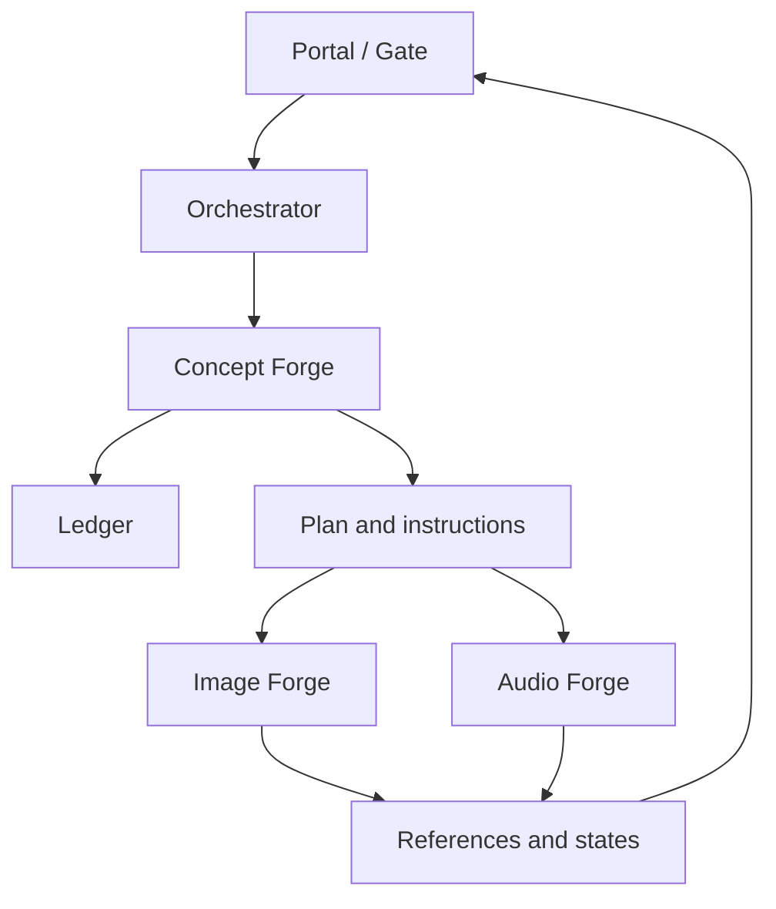

# Architecture and module boundaries

EverSpark Forge is a distributed AI OS. The host owns control, persistence and inter-Forge orchestration; Nodes execute model tasks on shared machines or in different regions. Tailscale provides connectivity. Agents register, send heartbeats and pull allowlisted tasks.

## Ownership

| Module | Responsibility | Directory |
| --- | --- | --- |
| Archon / Gate | HTTP routing, composition, Forge bindings and targets | `Archon/Gate/` |
| Portal | WebUI, proxies, status and result presentation | `Archon/Portal/` |
| Windows Client | Tauri/WebView2 window, portable Python host lifecycle, native downloads | `Archon/Client/Windows/` |
| Orchestrator | Admission, request deduplication, dependency order, task states and references | `Archon/Orchestrator/` |
| Ledger | SQLite/character persistence, transactions and revision consistency | `Archon/Ledger/` |
| Vault | Credentials, private settings and runtime configuration | `Archon/Vault/` |
| Steward | Instances, Node leases/resources and Forge deployment | `Archon/Steward/` |
| Concept Forge | Language models, discussion, character/Memory business, plans and instructions | `Legate/Forge/ConceptForge/` |
| Image Forge | ComfyUI/Diffusers adapters, resources, workflows, generation and history | `Legate/Forge/ImageForge/` |
| Audio Forge | VoxCPM2 speech instructions, synthesis, results and health | `Legate/Forge/AudioForge/` |
| Envoy | Agent task channel, authentication, heartbeats and supervision | `Legate/Envoy/` |
| Warden / Crucible | Execution runtimes, processes, hardware, environment and models | `Legate/Warden/`, `Legate/Crucible/` |
| Aegis | Storage transfers/archives/backups, networking and logging primitives | `Aegis/` |

Code ownership differs from physical execution. Forge management/business objects can remain on the host while remote adapters invoke Node executors. Host Ledger retains characters and Memory. Hosted Concept APIs are called directly by the host.

## Creation flow

```mermaid
flowchart TD
    P[Portal / Gate] --> O[Orchestrator]
    O --> C[Concept Forge]
    C --> L[Ledger]
    C --> T[Plan and instructions]
    T --> I[Image Forge]
    T --> A[Audio Forge]
    I --> R[References and states]
    A --> R
    R --> P
```

Image mode retains Concept preparation followed by Image submission. Audio and combined modes use Concept's step list. TaskRunner validates Forge targets, dependencies and cycles, then executes in dependency order. Diagram branches represent targets, **not a promise of parallel execution**. Failed steps cause pending steps to be skipped.

Orchestrator passes opaque instructions without resolving model/workflow business or compiling characters. Concept completion callbacks record business data. Completed image orchestration can mean submission only; rendering/history remain Image responsibilities. Task graphs/results do not constitute fully durable workflows with automatic replay.

## Control and recovery

NodeManager uses host monotonic time for leases. Independent Agent heartbeats continue during execution. Node connectivity, Forge health and deployment state are separate. Probes use an independent channel to avoid long installation/generation occupying the execution lane and causing false offline reports.

Agents record intent and outcomes and answer reconnection queries. Completed outcomes can be returned; interruption may leave an unknown outcome, without automatically repeating side effects. Recovery verifies source and health rather than treating a heartbeat as deployment success.

## Models and media

The host stores cloud configuration and mappings. Image/Concept model downloads and pulls execute on their corresponding Nodes, with targets fixed at job creation. Private task channels carry configuration snapshots. Character backup/restore runs on the host.

Media endpoints return references and temporary URLs; originals remain on Nodes. Browsers/clients prefer direct access, with a single-file forwarding fallback. Image/audio ZIPs are packaged on the corresponding Node and downloaded directly; the former remote ZIP forwarding path was removed. Host data ZIPs are separate. Signed file services constrain paths and do not expose arbitrary directories.

## Windows entry and limitations

Both packages share a Tauri EXE, Portal and portable Python 3.11.9. Standard uses installed WebView2; full includes a fixed Runtime. Dynamic ports, single-instance handling and Windows Job ownership manage local children. Closing the host does not destroy Nodes.

The current system does not promise automatic cross-machine parallelism, recovery of media after Node destruction, arbitrary model/workflow compatibility or unattended workflow replay. Unimplemented Video/3D features must not be described as available.

See module READMEs for implementation entry points and [Getting started](Getting-Started.md) for operation.
