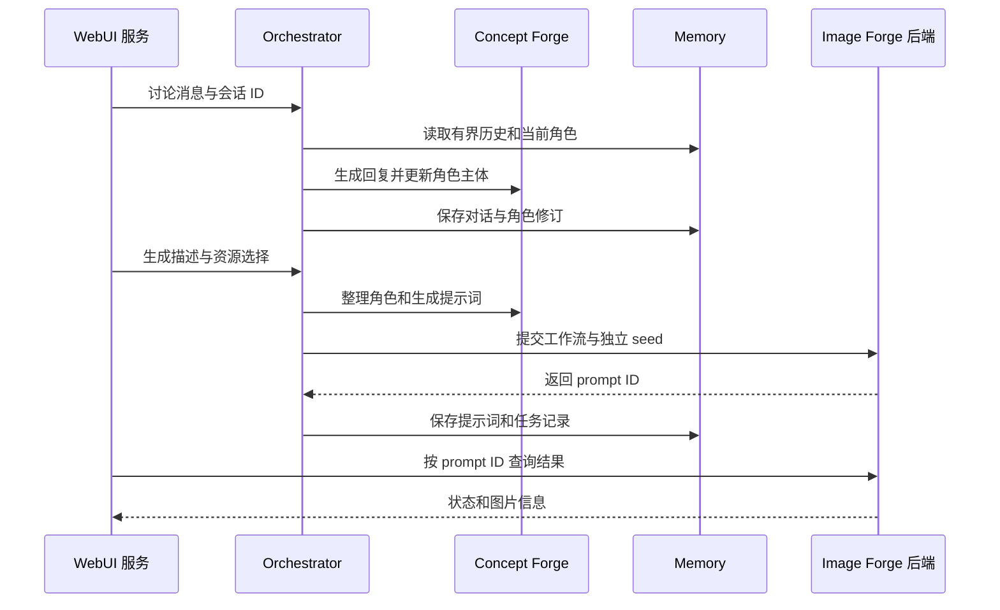

# EverSpark Forge 架构（v0.1）

EverSpark Forge 把用户的讨论与生成请求交给一个调度层，再由独立的概念处理和图像执行模块完成工作。v0.1 已经实现这条链路；它的设计允许替换模块，但**当前实际接入的概念提供者是 Ollama，图像执行适配器是 ComfyUI**。本文描述现有代码的职责和数据流，不把规划中的模块写成已实现功能。

## 1. 系统边界

| 层 | 当前职责 | 主要代码 |
| --- | --- | --- |
| WebUI | 浏览器交互、同源 API 代理、任务结果与图片展示、运行状态 | `WebUI/` |
| Orchestrator | 会话与请求调度、生成任务、资源选择、下载和备份任务入口 | `Orchestrator/` |
| Concept Forge | 与语言模型交互、角色主体生成与验证、提示词编译 | `ConceptForge/` |
| Memory | 会话历史、角色关联、角色修订、提示词文档和任务记录 | `Memory/`，运行数据在 `Data/Memory/` 与 `Data/Subjects/` |
| Image Forge | 读取 API Format 工作流、填充提示词和参数、提交图像任务 | `ImageForge/` |
| Runtime / Launcher | 安装与启动托管服务、硬件发现、进程和健康检查、日志 | `Runtime/`、`Launcher/`、根目录 `everspark` |
| Infrastructure | 可选的 rclone 远程存储与 Cloudflare Tunnel；本地模式无需启用 | `Infrastructure/` |

ComfyUI 和 Ollama 在托管安装时位于运行环境中，而不是 EverSpark 的模块名称。模型、私人配置、生成输出和记忆数据也不属于发布的源码。文件位置和迁移方式见[运行时与数据生命周期](Runtime-and-Data.zh-CN.md)。

## 2. 请求如何流动

浏览器只访问 WebUI；WebUI 服务把讨论、生成、角色和存储请求转给 Orchestrator。结果查询与图片读取由 **WebUI 服务**访问配置的 Image Forge 后端，再以同源接口返回浏览器。图中的“Image Forge 后端”在 v0.1 对应 ComfyUI；Ollama 则位于 Concept Forge 提供者之后。上图按职责概括顺序，单次生成中的角色刷新、提示词处理和数据库写入还有各自的校验与失败路径。

### 讨论与角色主体

一段会话有一个当前角色主体。Orchestrator 从 Memory 取出有界对话历史及当前文档，请 Concept Forge 根据讨论生成或更新角色，再校验并保存修订。用户可以在 WebUI 中把已有角色选入当前会话。

`Character Subject v1` 保存**可复用的角色身份**；场景、姿势、镜头、背景是每次请求的输入，不写回身份字段。系统还分别保存最近生成的正向与负向提示词文档，其中正向提示词可能包含上一次场景的内容，用于下一次生成的上下文。它们与角色身份文档不是同一个对象。

### 生成与取回

Orchestrator 再次读取当前角色与上下文；Concept Forge 形成生成计划及提示词，角色身份编译结果与本次场景合并。Image Forge 从已注册的 API Format 工作流构造**本次任务副本**，绑定可用的 Checkpoint、VAE、LoRA 等选项，给批量中的每张图片生成独立 seed，并经 ComfyUI 适配器提交任务。仓库内的工作流文件不因一次资源选择而被改写。

Orchestrator 返回提交得到的 `prompt_id`；WebUI 据此查询图像后端的任务历史并显示结果。v0.1 一次只处理一个由 Orchestrator 协调的请求，批量图片在这个请求内提交。图库展示近期图像，输出默认写入 `Data/Outputs/`。

## 3. 配置与资源从哪里来

没有私人 `.env` 时，存储与网络都是本地模式。运行时的具体默认值分布在各模块的配置中，例如 Orchestrator 的 `orchestrator/config/default_config.json`；`Configuration/default.yaml` 描述公开的配置契约，当前迁移阶段并非所有服务都由同一个 YAML 加载器读取。私人 `env.txt` / `.env` 的导入及可选后端见[配置指南](Configuration.zh-CN.md)。

WebUI 的资源列表由 Orchestrator 汇总：已注册工作流来自 Image Forge，Checkpoint、VAE、LoRA 来自当前 ComfyUI 可见的模型，语言模型来自 Ollama。选择被附在具体请求中；能否执行还取决于工作流的节点结构及模型兼容性。

托管安装会准备一条可用的起步路径，但架构不要求使用某个固定的私人模型。v0.1 的工作流注册器只执行 API Format JSON；标准 LoRA 注入依赖其支持的工作流结构。现有支持边界见 [Image Forge 说明](../ImageForge/README.md)。

## 4. 运行时、存储与外部入口

`./everspark setup` 安装托管运行时并准备模型；`./everspark start` 管理 Concept Forge、Image Forge、Orchestrator、WebUI 的启动顺序。Runtime 检查进程、健康接口、GPU 与日志，WebUI 的 Runtime 页面展示其中的就绪状态。

本地模式不依赖远程存储；公开模型直链下载也可单独使用。启用 rclone 后，Orchestrator 经 Infrastructure 的存储实现执行远程模型扫描与拉取、输出上传、角色数据快照和恢复。上传由用户发起，输出按整个文件夹选择；角色 JSON 与 Memory SQLite 作为一批数据恢复。WebUI 默认只监听本机地址：可通过 SSH 转发访问；`Runtime/Managed/quick_tunnel.py` 则由 `./everspark share` 显式启动临时公网入口，无需私人配置，但当前 WebUI 没有登录验证。带域名和凭据的 Named Tunnel 是独立的可选配置。

## 5. v0.1 的实现范围

- **已实现：** 讨论与生成共用会话；角色主体及修订持久化；API Format 图像工作流；运行状态；本地模型下载；可选远程模型与数据备份。
- **当前边界：** Concept Forge 使用 Ollama 提供者，Image Forge 使用 ComfyUI 适配器；同一时间仅有一个 Orchestrator 请求在运行；仅支持注册的 API Format 工作流及已实现的参数变更方式。
- **尚未实现：** 情节式记忆的自动提取、检索和整合；其它概念提供者或图像执行适配器不能仅凭改一个配置值就立即投入使用。

需要修改模块时，可先从对应目录的 README 和本篇的请求流定位代码；启动及故障定位分别见[首次运行](Getting-Started.zh-CN.md)和[排障指南](Troubleshooting.zh-CN.md)。
