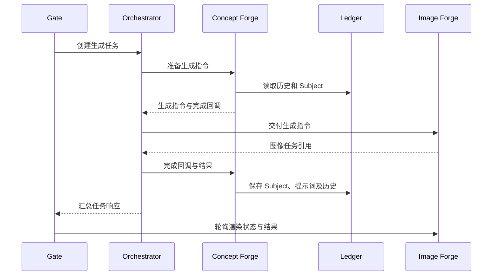

# EverSpark Forge 架构

Orchestrator 只编排 Forge 之间的任务。Concept Forge 拥有语言模型执行、Memory 和 Subject 业务；Image Forge 拥有 ComfyUI、Diffusers 及内部执行资源。本篇描述 `refactor/distributed-architecture` 当前实现。

## 模块边界

| 模块 | 当前职责 | 主要代码 |
| --- | --- | --- |
| Portal / Gate | WebUI、HTTP 路由、模块装配、Forge Node 绑定 | `Archon/Portal/`、`Archon/Gate/` |
| Orchestrator | 任务接收、准入、状态、Concept → Image 步骤协调、结果引用汇总 | `Archon/Orchestrator/` |
| Concept Forge | Provider/Model、连接测试、讨论、Subject 生成/修订/编译、Memory 业务、提示词计划 | `Legate/Forge/ConceptForge/` |
| Ledger | SQLite/文档持久化、事务、修订一致性与读取 | `Archon/Ledger/` |
| Image Forge | 后端选择、workflow/checkpoint/VAE/LoRA、插件、健康、任务生成历史 | `Legate/Forge/ImageForge/` |
| Storage | 下载、存储、输出文件、远端传输缓存、上传、同步、备份与恢复 | `Aegis/Storage/` |
| Vault | 凭据、Provider 私有配置、运行配置读取 | `Archon/Vault/` |
| Steward | Node 注册/心跳/在线状态/资源上报、节点与部署管理 | `Archon/Steward/` |
| Warden / Envoy | 节点运行时、进程和后端生命周期；既有 Agent 任务通道 | `Legate/Warden/`、`Legate/Envoy/` |

Audio Forge 和 Video Forge 是后续独立 Forge 的边界，本次没有新增它们的调用流程。

## 生成数据流

```mermaid
sequenceDiagram
    participant G as Gate
    participant O as Orchestrator
    participant C as Concept Forge
    participant L as Ledger
    participant I as Image Forge
    G->>O: 创建生成任务
    O->>C: 准备生成指令
    C->>L: 读取历史和 Subject
    C-->>O: 生成指令与完成回调
    O->>I: 交付生成指令
    I-->>O: 图像任务引用
    O->>C: 完成回调与结果
    C->>L: 保存 Subject、提示词及历史
    O-->>G: 汇总任务响应
    G->>I: 轮询渲染状态与结果
```

Orchestrator 不读取或编译 Subject，不解析 Provider、engine、workflow 或模型资源。旧 WebUI 的 `selection` 仍可提交，但由编排层完整转交给 Forge，具体资源解析在 Forge 内完成。

Concept Forge 复用现有 `concept_forge/subjects` 与 `Memory/everspark_memory`。Memory 中的身份生成、旧 prompt contract 转换、对话语义和角色展示仍由 Concept 负责；Ledger 保存已有数据格式和修订，不决定角色内容。

Image Forge 生成图像任务、选择后端并管理历史，实际输出文件的安全读取和分块传输复用 Storage。既有远端 `chat/resources/default_negative/submit/poll/history/fetch` action 和 Node 注册协议保持一致。

## 运行与兼容

当前分布式模式仍是本地主机上的 Gate、Orchestrator 和 Forge 管理代码，通过既有 Envoy 通道调用两台远端 Node 的模型/图像执行器。业务代码的模块归属迁移不等于把整个管理服务搬到 Node；本次没有新增远端业务协议。Concept 的持久化仍位于本地主机，由 Ledger 提供。

HTTP 服务移至 Gate，原 `orchestrator.core.server` 保留启动兼容入口。原资源、角色、记忆和存储 URL 保留，分别转给所属模块。Forge Node 绑定和远端 target 仍能定位并调用 Forge。

默认运行配置位于 `Archon/Vault/default_config.json`，配置读取位于 Vault。旧 `EVERSPARK_ORCHESTRATOR_CONFIG` 环境变量和 Python loader import 继续支持；用户自定义配置文件不需转换。连接私有数据仍保存在 `Data/Configuration/ConceptForge/`，由 Vault 负责文件读写，不随角色 ZIP 导出。

生成任务仍串行准入；`completed` 继续表示规划和图像提交完成，实际渲染状态由 Image Forge 返回。Orchestrator 现有 job map 保存任务响应与引用，不持有 Forge 图库。没有新增并行调度、持久化工作流恢复或自动重新生成。

完整迁移方法清单、文件清单与验证结果见[职责迁移记录](Orchestrator-Boundaries.zh-CN.md)。
