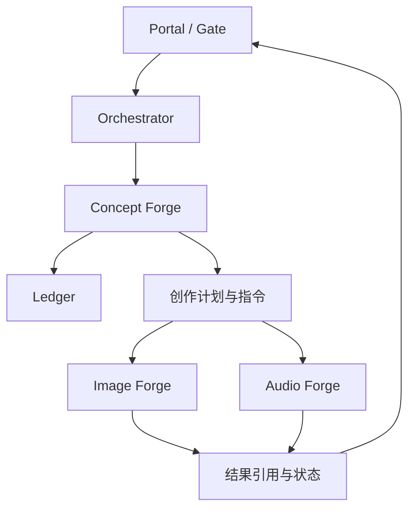

# 架构与模块边界

EverSpark Forge 是分布式 AI OS。主机负责控制、持久化与跨 Forge 编排，节点执行模型任务；组件可位于同机或不同地区。Tailscale 提供连接网络，Node Agent 主动注册、心跳并拉取允许执行的任务。

## 所有权

| 模块 | 责任 | 目录 |
| --- | --- | --- |
| Archon / Gate | HTTP 路由、模块装配、Forge 绑定与调用目标 | `Archon/Gate/` |
| Portal | WebUI、请求代理、状态与结果展示 | `Archon/Portal/` |
| Windows Client | Tauri/WebView2 窗口、便携 Python 主机生命周期、原生下载 | `Archon/Client/Windows/` |
| Orchestrator | 任务准入、请求去重、依赖顺序、任务状态和结果引用 | `Archon/Orchestrator/` |
| Ledger | SQLite／角色文档持久化、事务与修订一致性 | `Archon/Ledger/` |
| Vault | 私人配置、凭据、运行配置加载 | `Archon/Vault/` |
| Steward | 实例管理、Node 租约、资源状态和 Forge 部署 | `Archon/Steward/` |
| Concept Forge | 语言模型、讨论、角色／Memory 业务、创作拆解及指令准备 | `Legate/Forge/ConceptForge/` |
| Image Forge | ComfyUI／Diffusers 适配器、资源、工作流、生成与历史 | `Legate/Forge/ImageForge/` |
| Audio Forge | VoxCPM2 语音指令、合成、音频结果与健康 | `Legate/Forge/AudioForge/` |
| Envoy | Agent 任务通道、认证、心跳与监督重启 | `Legate/Envoy/` |
| Warden / Crucible | 执行端运行时、进程、硬件、环境和模型准备 | `Legate/Warden/`、`Legate/Crucible/` |
| Aegis | Storage 文件传输／归档／备份、网络与日志基础能力 | `Aegis/` |

目录归属与运行位置不是一回事。Forge 管理／业务对象仍可在主机，通过远端适配器调用节点执行器；角色与 Memory 默认由主机 Ledger 保存。外部 Concept API 由主机直接调用。

## 创作流程

```mermaid
flowchart TD
    P[Portal / Gate] --> O[Orchestrator]
    O --> C[Concept Forge]
    C --> L[Ledger]
    C --> T[创作计划与指令]
    T --> I[Image Forge]
    T --> A[Audio Forge]
    I --> R[结果引用与状态]
    A --> R
    R --> P
```

图片模式保留 Concept 准备指令 → Image 提交的路径；音频与组合模式由 Concept 提供步骤列表，TaskRunner 校验 Forge 目标、依赖和循环，按依赖顺序执行。图中分支表示可选执行目标，**不是并行执行承诺**。单个任务失败后，尚未执行的步骤标记 skipped。

Orchestrator 转交 Forge 内部指令，不解析模型／工作流业务或编译角色；Concept 完成回调记录业务数据。图片编排任务完成可能只表示图像已提交，渲染与历史继续由 Image 提供。任务图和执行结果没有完整的持久化工作流自动重放。

## 控制与恢复

NodeManager 使用主机单调时钟管理租约；Agent 有独立心跳，执行期间可继续报告。Node 在线、Forge 健康、部署任务状态分别展示。健康探测有独立通道，避免长安装／生成独占执行通道导致误报。

Agent 记录任务意图与结果，重连查询已有任务；已完成结果可返回，执行中断可能结果未知，不自动重新执行副作用。部署恢复需要验证源码和服务健康，不能把“收到心跳”当作部署成功。

## 模型与媒体

云端配置与目录映射由主机保存；模型直链和云端拉取在对应 Image／Concept 节点执行，启动任务时固定目标。配置快照由私有任务通道传入节点；角色备份与恢复在主机执行。

媒体结果返回引用和临时访问 URL，原件留在节点。浏览器／客户端优先直连节点；单文件有转发备用路径。图片／音频 ZIP 在对应节点打包后直链下载，旧远端 ZIP 转发链路已移除；本机数据 ZIP 是独立功能。节点文件服务使用签名和路径限制，不开放任意目录。

## Windows 入口与当前限制

两个客户端包共用 Tauri EXE、Portal 和便携 Python 3.11.9；standard 依赖系统 WebView2，full 携带固定 Runtime。主机端口动态分配，单实例与 Windows Job 管理自身子进程。关闭主机不销毁节点。

不承诺跨机器自动并行、节点损毁后媒体可恢复、任意模型／工作流兼容或无人值守工作流重放。Video、3D 等未实现能力不能列为已支持功能。

协议与接口的实现入口见对应模块 README；使用说明见[首次使用](Getting-Started.zh-CN.md)。
